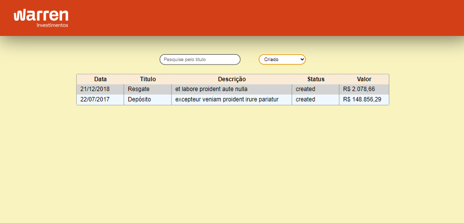
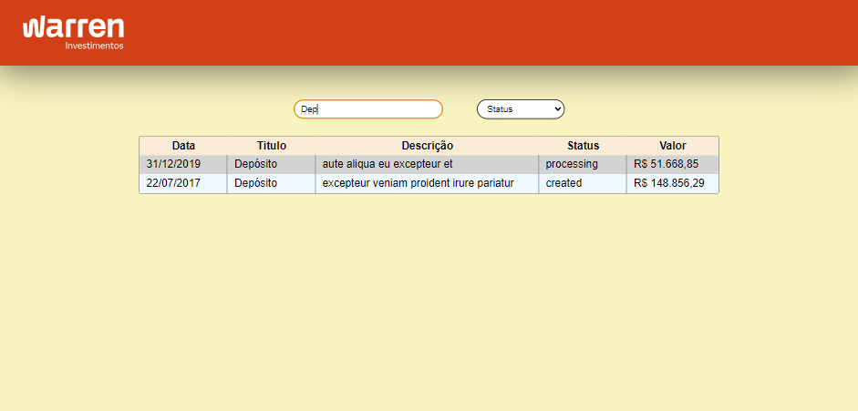
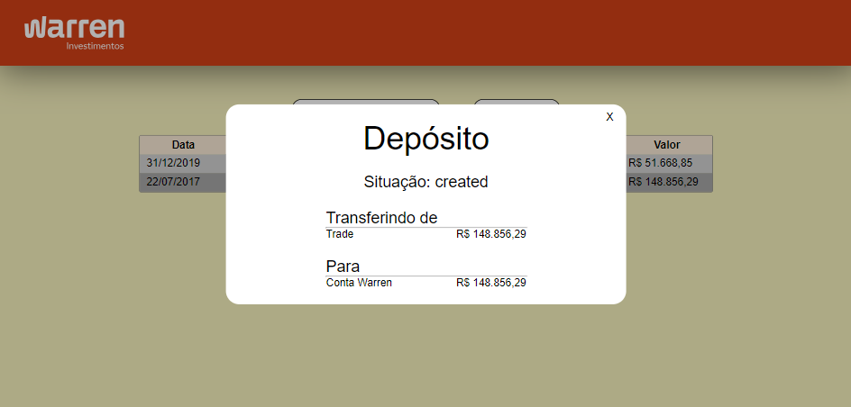

# Desafio Warren Web - Clean Architecture

## Sobre o projeto

O desafio consiste em implementar uma dashboard de transações, mostrando os principais dados relacionados a cada uma delas. Sendo possivel Filtrar por titulo e por status, onde quando clicamos em alguma transação, um modal é aberto contendo os detalhes da transação.

Foi adotado os principios da Clean Architecture para manter a organização e evolução do projeto.

## Como executar a aplicação

- IMPORTANTE: Tenha o Node.js instalado

- Executando a API fake
1) `cd ./core`
2) `npm install`
3) `npm run fake-api`

- Executando a aplicação VueJS
1) `cd ./vue-presentation`
2) `npm install`
3) `npm run dev`

- Para buildar o projeto core
1) `cd ./core`
2) `npm run build`

- Para testar a aplicação core
1) `cd ./core`
2) `npm run test`

- Para testar a aplicação VueJS
1) `cd ./core`
2) `npm run test:e2e:dev`

## Tecnologias utilizadas

### Para a aplicação core

- Typescript
- Axios
- Jest

### Para a aplicação VueJS

- VueJS
- Typescript
- Less
- Cypress

## Telas da aplicação

- Dashboard de transações

- Dashboard de transações filtradas por status de criado

- Dashboard de transações filtradas por titulo

- Modal contendo os detalhes da transação

